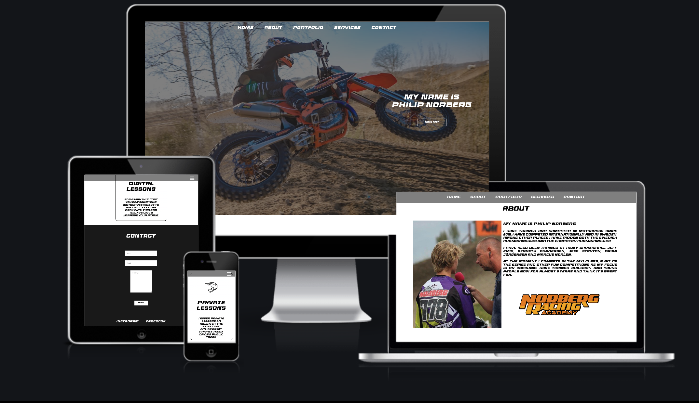
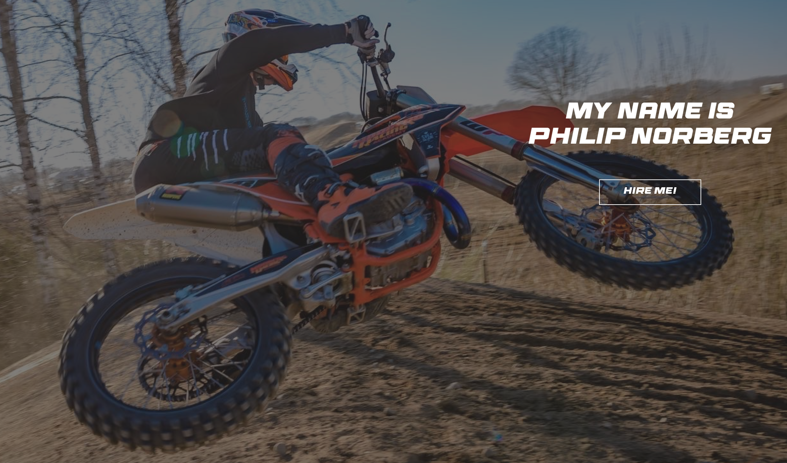
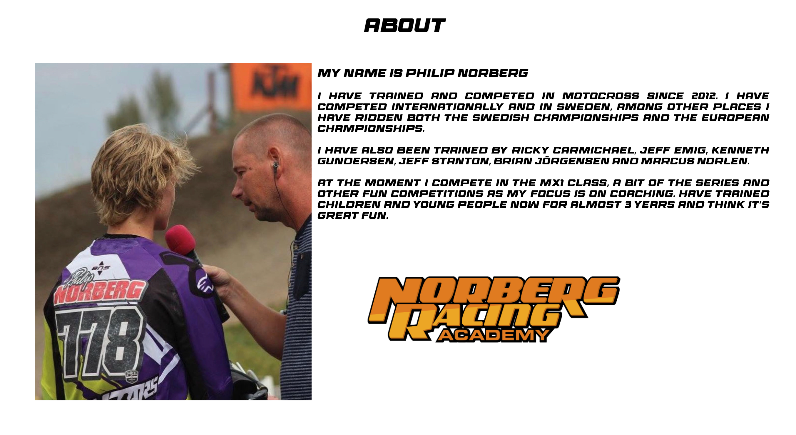
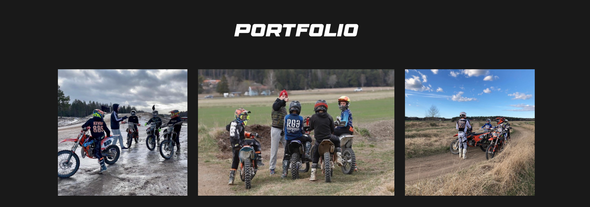
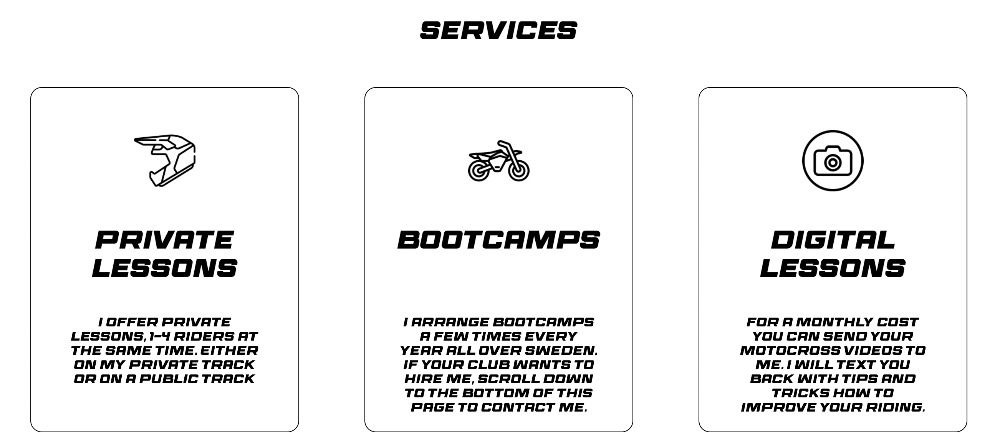
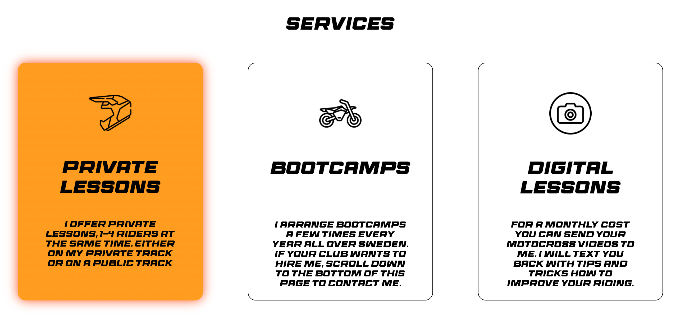
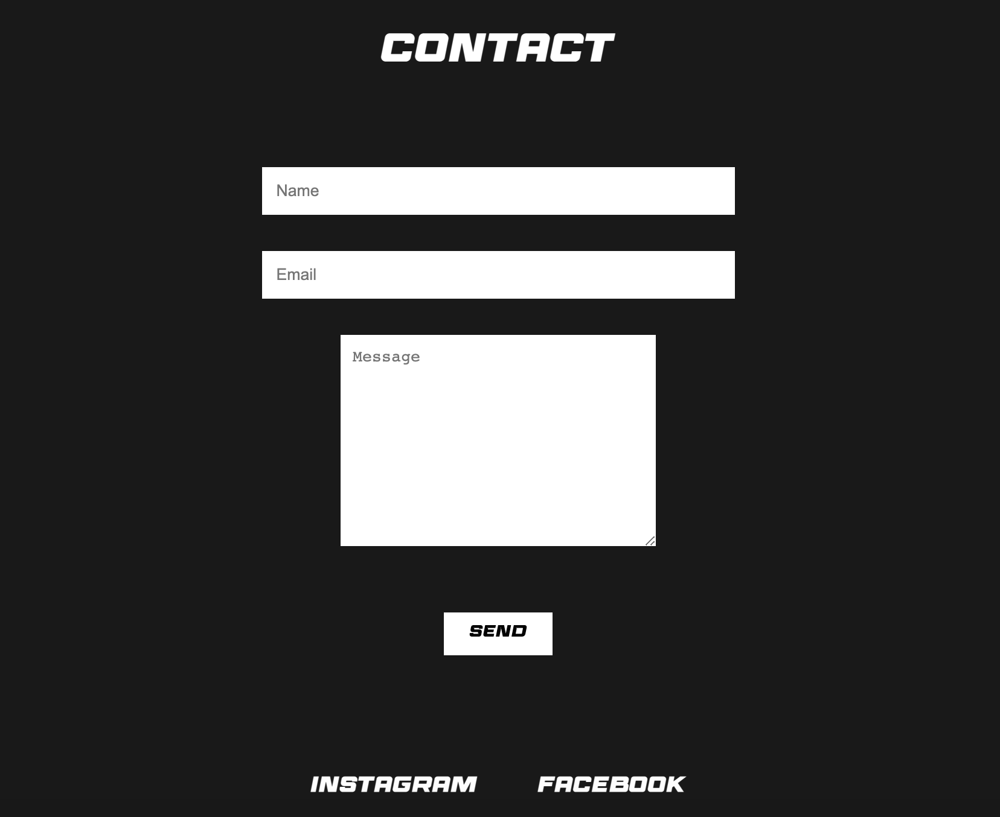
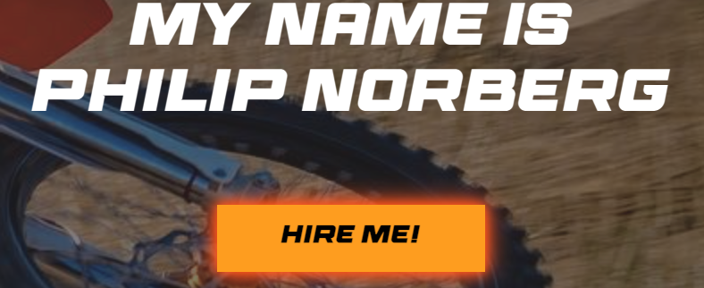
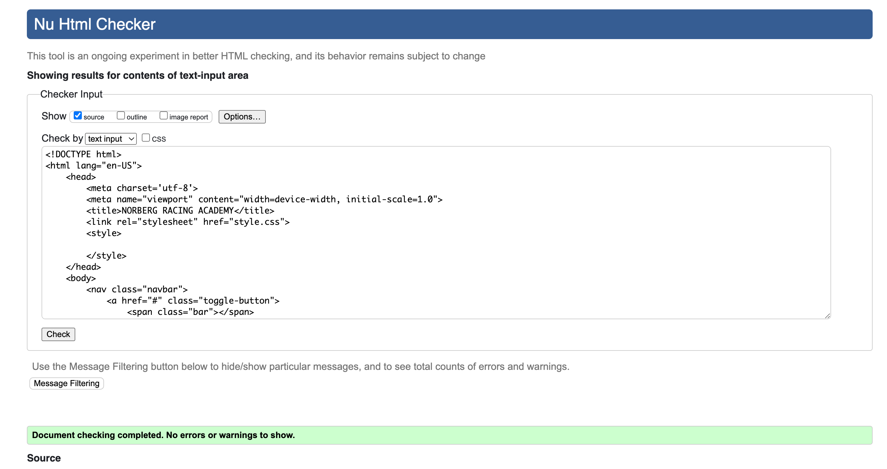
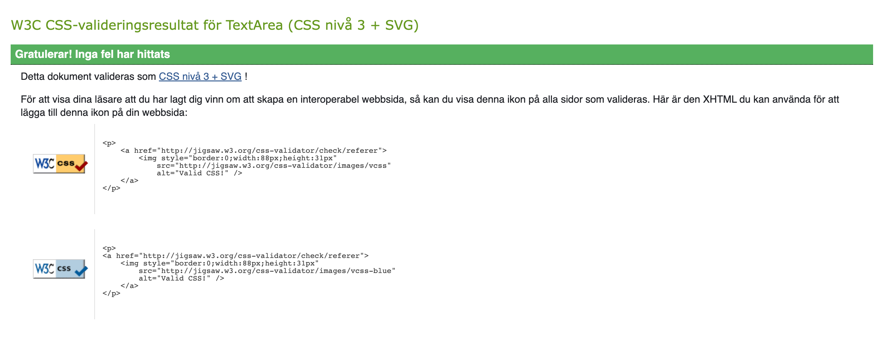

# NORBERG RACING ACADEMY
Welcome to NORBERG RACING ACADEMY, my consulting website as a private coach for motocross riders!
Here you can hire me as your private coach to improve your motocross skills, ride more safe and increase your speed. You'll find all information you need on this website, and if you have any questions dont hestitate to contact me in the contact section. 

# Feature
## Existing Features
* ### Navigation Bar
    * Responsive navigation bar includes links to home, about, portfolio, service and contact. Featured on all three pages, easy to navigate.
    * This makes it easy for the user to navigate through the differens pages instead of clicking the back button on the browser.

* ### The landing page image
    * The landing page image is a picture of me (the coach) riding my dirtbike to show what the website is about and get a professional feeling visiting the website. It also shows exactly what enviroment the coaching will take place. 
    * This section introduce the user to the coach with an eyecatching text and button.

* ### The About page
    * The About page has a description of me and my career. It also has a picture of of me getting interviewed to make the page look more alive.
    * In the end of the page is our logo of our instagram account 'NORBERG RACING ACADEMY', this picture is also there to make the page look more alive.
    * This page is important for the user/customer so they know a little about the coach and why they should hire me.

* ### The portfolio page
    * This page gives a brief picture of how the private lessons and bootcamps goes on.
    * In this page there will be more pictures posted as time goes on. 

* ### The service page
    * The service page shows and describes the different package I offer. 
    * The icons are there to symbolize the text.
    * The second service image shows what happens if you hover over the box, it gets orange. 

* ### The contact page
    * Here you can type your name, email and message to contact me.
    * Further down on this page we have our footer, two buttons to our social medias. Both buttons will open a new tab. 

* ### Buttons
    * If you hover over any button on the page you will notice it turns orange and get highlighted.

 # Features left to implement
* ### A working toggle button with help of java script
* ### Another feature idea

# Testing
* ### HTML
    * No errors were returned when passing through the official W3C validator
 
 * ### CSS
    * No errors were returned when passing through the official (Jigsaw) validator

# Unfixed bugs
* ### Togglebutton on smaller device
    * I found out that I need to use JavaScript to make it work correctly, so now the button only shows. I still kept it there to make it look more sense when you're on a smaller screen. 

# Deployment

# Credits

